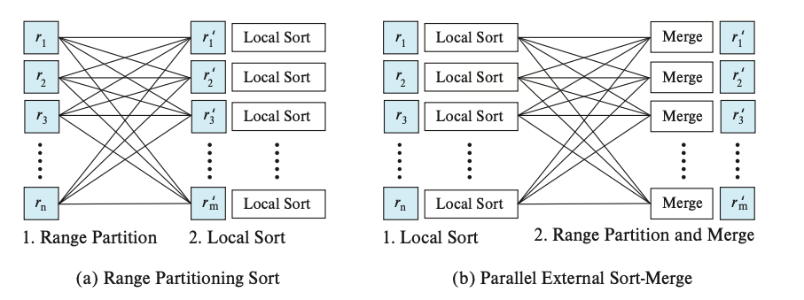

# Parallel Sort

Suppose that we wish to sort a relation `r` that resides on `n` nodes N1, N2, ... , Nn. If the relation has been range-partitioned on the attributes on which it is to be sorted, we can sort each partition separately and concatenate the results to get the full sorted relation. Since the tuples are partitioned on `n` nodes, the time required for reading the entire relation is reduced by a factor of `n` by the parallel access.

If relation `r` has been partitioned in any other way, we can sort it in one of two ways:

1. We can range-partition `r` on the sort attributes, and then sort each partition separately.
2. We can use a parallel version of the external sort-merge algorithm.

## 22.2.1 Range-Partitioning Sort

Range-partitioning sort, shown pictorially in Figure 22.1a, works in two steps: first range-partitioning the relation, then sorting each partition separately. When we sort by range-partitioning the relation, it is not necessary to range-partition the relation on the same set of nodes as those on which that relation is stored. Suppose that we choose nodes N1, N2, ... , Nm to sort the relation. There are two steps involved in this operation:

1. Redistribute the tuples in the relation, using a range-partition strategy, so that all tuples that lie within the *i*th range are sent to node ni, which stores the relation temporarily on its local disk.

    To implement range partitioning, in parallel every node reads the tuples from its disk and sends each tuple to its destination node based on the partition function. Each node N1, N2, ... , Nm also receives tuples belonging to its partition and stores them locally. This step requires disk I/O and network communication.

  

2. Each of the nodes sorts its partition of the relation locally, without interaction with the other nodes. Each node executes the same operation — namely, sorting — on a different data set. (Execution of the same operation in parallel on different sets of data is called data parallelism.)

    The final merge operation is trivial because the range partitioning in the first phase ensures that, for `1 ≤ i < j ≤ m`, the key values in node Ni are all less than the key values in Nj.

    We must do range partitioning with a balanced range-partition vector so that each partition will have approximately the same number of tuples. We saw how to create such partition vectors in Section 21.3.1. Virtual node partitioning, as discussed in Section 21.3.2, can also be used to reduce skew. Recall that there are several times as many virtual nodes as real nodes, and virtual node partitioning creates a partition for each virtual node. Virtual nodes are then mapped to real nodes; doing so in a round-robin fashion tends to spread virtual nodes across real nodes in a way that reduces the degree of skew at real nodes.

## 22.2.2 Parallel External Sort-Merge

Parallel external sort-merge, shown pictorially in Figure 22.1b, is an alternative to range partitioning sort. Suppose that a relation has already been partitioned among nodes N1, N2, ... , Nn (it does not matter how the relation has been partitioned). Parallel external sort-merge then works this way:

1. Each node Ni sorts the data available at Ni.
2. The system then merges the sorted runs on each node to get the final sorted output.

The merging of the sorted runs in step 2 can be parallelized by this sequence of actions:

1. The system range-partitions the sorted partitions at each node Ni (all by the same partition vector) across the nodes N1, N2, ... , Nm. It sends the tuples in sorted order, so each node receives the tuples as sorted streams.
2. Each node Ni performs a merge on the streams of tuples as they are received to get a single sorted run.
3. The system concatenates the sorted runs on nodes N1, N2, ... , Nm to get the final result.

As described, this sequence of actions results in an interesting form of execution skew since at first every node sends all tuples of partition 1 to N1, then every node sends all tuples of partition 2 to N2, and so on. Thus, while sending happens in parallel, receiving tuples becomes sequential: First only N1 receives tuples, then only N2 receives tuples, and so on. To avoid this problem, the sorted sequence of tuples Si,j from any node `i` destined to any other node `j` is broken up into multiple blocks. Each node Ni sends the first block of tuples from Si,j to node Nj, for each `j`; it then sends the second block of tuples to each node Nj, and so on, until all blocks have been sent. As a result, all nodes receive data in parallel. (Note that tuples are sent in blocks, rather than individually, to reduce network overheads.)
